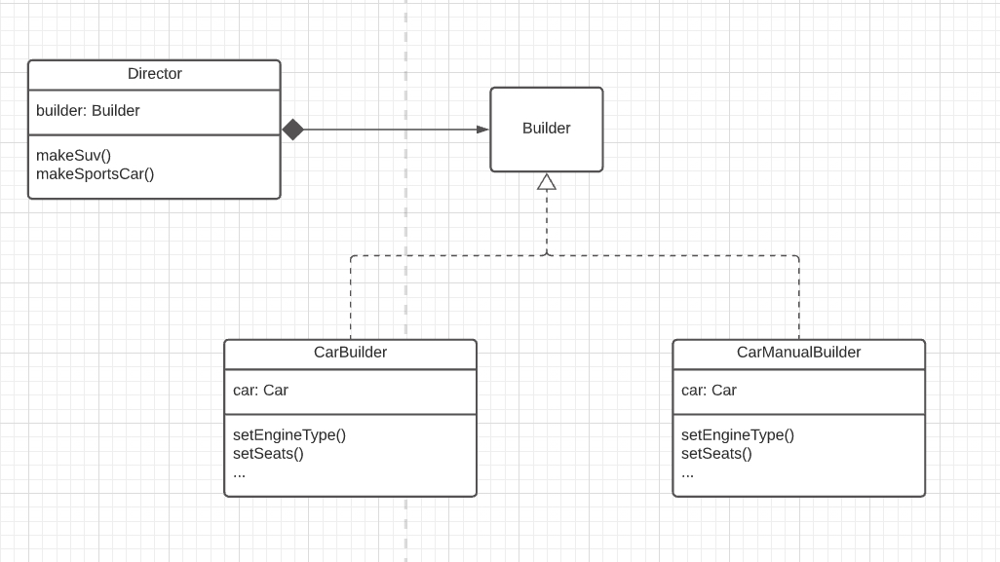

**Builder** is a creational design pattern is a creational design pattern that lets you construct complex objects step by step. **The important part is that you don’t need to call all of the steps. You can call only those steps that are necessary for producing a particular configuration of an object**.

